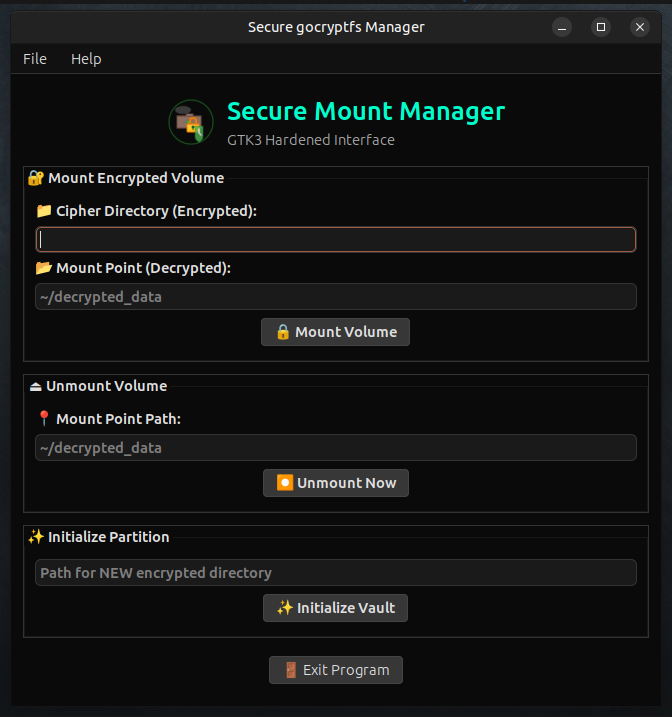

# Secure Mount GTK3

[](LICENSE)
[](#)
[](#)
[](#)
[](#)

**Secure Mount GTK3** (also known as Secure gocryptfs Manager) is a modern, GTK3-based graphical user interface for managing `gocryptfs` encrypted volumes. It provides a simple and intuitive way to initialize, mount, and unmount encrypted directories without needing to use the command line for basic operations.

---

## 📸 Screenshot

<div align="center">
  
  <br/>
  <em>Secure Mount GTK3 main dashboard — mount, unmount, and initialize encrypted volumes with ease</em>
</div>

---

## Features

- **Mount Volumes**: Easily mount encrypted "cipher" directories to a "decrypted" mount point.
- **Unmount Volumes**: Safely unmount active encrypted volumes.
- **Initialize New Volumes**: Create and set up new encrypted directories directly from the GUI.
- **Desktop Integration**: Includes a desktop entry, icons, and system menu integration for Ubuntu MATE and other GTK-based environments.
- **Terminal Integration**: Automatically opens a terminal window for secure password entry.
- **Status Monitoring**: Visual feedback on operations via a progress bar and status labels.

## Prerequisites

### Build Dependencies
To compile the application from source, you will need the following installed on your system:

- **C Compiler**: `gcc`
- **Build System**: `make`
- **Development Headers**: `libgtk-3-dev` (GTK+ 3 development packages)
- **Helper Tools**: `pkg-config`

On Ubuntu/Debian-based systems, you can install these with:
```bash
sudo apt-get update
sudo apt-get install gcc make libgtk-3-dev pkg-config
```

### Runtime Dependencies
The following programs must be available at runtime:

- **gocryptfs**: The encryption backend.
- **fuse3** or **fuse**: For mounting filesystems in userspace.
- **Terminal Emulator**: One of `mate-terminal`, `gnome-terminal`, `xfce4-terminal`, or `xterm`.

On Ubuntu/Debian-based systems:
```bash
sudo apt-get install gocryptfs fuse3
```

### Optional Dependencies
For generating application icons from the source SVG:
- **librsvg2-bin** (provides `rsvg-convert`) OR
- **imagemagick** (provides `convert`)

## Installation

### 1. Build the Application
Compile the source code:
```bash
make
```

### 2. Generate Icons (Optional but Recommended)
Generate the necessary PNG icons from the source SVG:
```bash
make icons
```

### 3. Install
You can choose between a local installation (for the current user) or a global installation (system-wide).

#### Local Installation (No sudo required)
This installs the binary to `~/.local/bin` and the desktop files to `~/.local/share`.
```bash
make install-local
```

#### Global Installation (Requires sudo)
This installs the application to `/usr/local/bin` and makes it available to all users.
```bash
sudo make install
```

#### Quick Start
To build and install locally in one step:
```bash
make quick-install
```

## Usage

Once installed, you can launch **Secure Mount** from your applications menu (typically under the **System** category) or by running:

```bash
secure_mount_gtk3
```

### Basic Workflow
1. **Initialize**: Use the "Initialize" section to create a new encrypted folder.
2. **Mount**: Enter the path to your encrypted folder (Cipher) and the folder where you want to see your files (Mount Point), then click **Mount**. A terminal will pop up asking for your password.
3. **Access Files**: Your files are now available in the Mount Point directory.
4. **Unmount**: When finished, enter the Mount Point path and click **Unmount** to lock your files again.

## Uninstallation

To remove the application:

- **Local**: `make uninstall-local`
- **Global**: `sudo make uninstall`

## License
This project is provided as-is. See the source code for specific licensing information.
```
